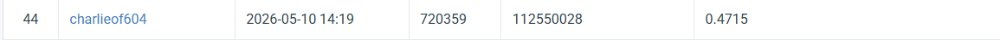

# VIS HW3: Cell Instance Segmentation

## Introduction

This repository contains my implementation for VIS HW3, a multi-class microscopic cell instance segmentation task. The goal is to detect each individual cell, classify it into one of four categories, and output pixel-level instance masks.

The final model is based on Mask R-CNN with a Swin Transformer-Tiny backbone. Compared with the ResNet-50 Mask R-CNN baseline, the Swin-based model achieved better validation and competition performance, especially in dense cell regions where instances are small, overlapping, and visually similar.

Main files:

- `swin_colab.py`: Main training and inference script for Swin Mask R-CNN.
- `VIS_hw3.ipynb`: Colab notebook for environment setup, dataset extraction, training, and inference.

## Environment Setup

This project was mainly tested on Google Colab with GPU runtime.

### 1. Prepare Google Drive

Place the dataset archive in:

/content/drive/MyDrive/vis_hw3/hw3-data-release.tar

Expected extracted structure:

/content/hw3_data/
├── train/
└── test_release/

Place swin_colab.py in:

/content/drive/MyDrive/vis_hw3/

### 2. Install Dependencies

The notebook VIS_hw3.ipynb contains the full setup commands.

Required major packages:

python 3.10
torch
torchvision
mmcv
mmengine
mmdet
pycocotools
tifffile
imagecodecs
opencv-python
numpy

If running manually in Colab, first mount Google Drive:

from google.colab import drive
drive.mount("/content/drive")

Then run the setup cells in VIS_hw3.ipynb.

Usage
#### 1. Train

Run:

cd /content/drive/MyDrive/vis_hw3
MPLBACKEND=Agg /content/bin/micromamba run -p /content/mmdet_env python -u swin_colab.py train

The script will:

Extract or read the dataset.
Convert annotations into COCO format.
Generate the MMDetection runtime config.
Train Swin Mask R-CNN.
Save checkpoints and validation results.

Outputs are saved under:

output_exp/swin/

Important files:

output_exp/swin/coco/instances_train.json
output_exp/swin/coco/instances_val.json
output_exp/swin/_runtime_swin_config.py
output_exp/swin/work/

#### 2. Inference

Run:

cd /content/drive/MyDrive/vis_hw3
MPLBACKEND=Agg /content/bin/micromamba run -p /content/mmdet_env python -u swin_colab.py infer

The script loads the best checkpoint and generates the final prediction JSON for submission.

Expected output:

output_exp/swin/submission.json

The JSON follows the required format:

[
  {
    "image_id": 1,
    "bbox": [x, y, width, height],
    "score": 0.56789,
    "category_id": 1,
    "segmentation": {
      "size": [height, width],
      "counts": "encoded_rle_string"
    }
  }
]
Performance Snapshot

Main findings:

Replacing ResNet-50 with Swin-T produced the largest improvement.
A deeper but narrower mask head gave a small validation improvement.
Soft-NMS improved validation behavior but did not improve competition performance.
